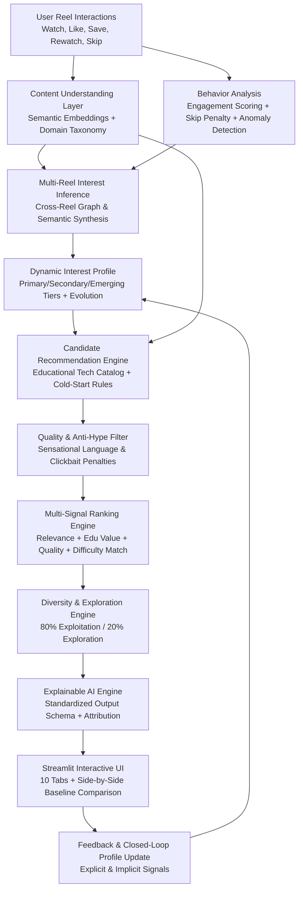

# 🎯 THE ALGORITHM KNOWS YOU TOO WELL
### AI-Powered Educational Short-Form Recommendation Agent

An intelligent, explainable, and privacy-preserving AI recommendation system designed to transform passive short-form video (Reel) scrolling into high-impact educational technology learning paths.

---

## 📌 1. Problem Statement
Students spend significant time scrolling short-form content. While much of it provides casual entertainment, it rarely yields structured educational or career value. Standard commercial recommender systems are built purely for engagement optimization (maximizing watch time and ad views), frequently trapping students in shallow repetitive loops or surface-level keyword silos.

The goal is **not to stop social media usage**, but to make existing scrolling significantly more constructive by inferring underlying interests and recommending high-value technology content.

---

## 🔍 2. Problem Analysis & The "Built-In Trap"
### The Superficial Keyword Trap
In conventional recommendation algorithms, if a student watches:
- A Java debugging meme 😂
- A "Day in the Life of a FAANG Software Engineer" ☕
- A LeetCode hard coding interview joke 😭
- An M3 Max MacBook vs ThinkPad developer comparison 💻

A naive keyword-based system observes the word **"Java"** or **"Meme"** and repeatedly recommends *generic Java beginner tutorials* or more memes.

### The Semantic Solution
A deeper AI reasoning engine recognizes that these disparate interactions share a single underlying conceptual centroid: **Software Engineering / Technology**. Instead of spamming Java tutorials, the system recommends high-leverage modern technical skills such as **AI-Assisted Software Development**, **Distributed System Architecture (HLD)**, or **Microservices**.

Additionally, the system explicitly defends against sensational hype content (e.g. *"10 AI tools that will replace coders and make you $10k/day"*), penalizing clickbait and prioritizing verified educational quality.

---

## 🚀 3. System Architecture & Data Flow



---

## 🧩 4. Modular Breakdown

| Module | Location | Purpose & Core Responsibility |
| :--- | :--- | :--- |
| **Data Manager** | `modules/data_manager.py` | Manages dataset seeding, retrieval, and SQLite orchestration. |
| **Content Understanding** | `modules/content_understanding.py` | Extracts Topic, Context, Intent, Broader Domain, and Vector Embeddings. |
| **Behavior Analysis** | `modules/behavior_analysis.py` | Computes engagement scores with weighted positive signals and skip penalties. |
| **Anomaly Detection** | `modules/anomaly_detection.py` | Identifies isolated outlier interactions to prevent profile drift. |
| **Interest Inference** | `modules/interest_inference.py` | Multi-Reel semantic reasoning engine resolving the built-in trap. |
| **Interest Profile** | `modules/interest_profile.py` | Dynamic multi-interest profile manager with temporal evolution tracking. |
| **Quality Filter** | `modules/quality_filter.py` | Anti-hype / clickbait detector and credibility scoring engine. |
| **Diversity Engine** | `modules/diversity_engine.py` | Intra-list diversity bonus and repetitive category penalty. |
| **Exploration Engine** | `modules/exploration_engine.py` | Configurable Exploration vs. Exploitation balance (e.g. 80/20). |
| **Ranking Engine** | `modules/ranking_engine.py` | Composite multi-factor scoring formula for recommendation ranking. |
| **Recommendation Engine** | `modules/recommendation_engine.py` | Top-level coordinator handling cold starts and difficulty estimation. |
| **Explainable AI** | `modules/explainability.py` | Formats recommendations in the exact required standardized schema. |
| **Feedback Engine** | `modules/feedback_engine.py` | Captures user feedback and closes the loop with real-time profile updates. |
| **Evaluation Engine** | `modules/evaluation.py` | Benchmark comparison between Naive Baseline and Advanced AI Agent. |
| **Privacy Manager** | `modules/privacy.py` | Anonymous IDs (`USER_001`), personalization toggles, and GDPR data erasure. |
| **Security Engine** | `modules/security.py` | Prompt injection defense, untrusted content isolation, and sanitization. |

---

## 🔬 5. Mathematical Formulations & Algorithms

### A. Behavioral Engagement Scoring
$$\text{Engagement Score} = \min\left(1.0, \max\left(0.0, \, w_{\text{wc}} \cdot \text{watch\_comp} + w_{\text{lk}} \cdot \text{like} + w_{\text{sv}} \cdot \text{save} + w_{\text{sh}} \cdot \text{share} + w_{\text{rw}} \cdot \text{rewatch} - w_{\text{sk}} \cdot \text{skip}\right)\right)$$
*Defaults:* $w_{\text{wc}}=0.40, w_{\text{lk}}=0.20, w_{\text{sv}}=0.20, w_{\text{sh}}=0.10, w_{\text{rw}}=0.10, w_{\text{sk}}=0.30$.

### B. Composite Recommendation Ranking Formula
$$\text{Final Score} = w_r \cdot \text{Relevance} + w_i \cdot \text{InterestMatch} + w_e \cdot \text{EduValue} + w_q \cdot \text{Quality} + w_d \cdot \text{DiffMatch} + w_{\text{div}} \cdot \text{Diversity} + w_{\text{exp}} \cdot \text{Exploration} - w_h \cdot \text{HypePenalty}$$

---

## 🛡️ 6. Privacy & Cybersecurity Architecture
1. **Data Minimization & Anonymity:** Zero PII is collected or persisted. All profiles use anonymous handles (e.g. `USER_001`).
2. **User Agency & Control:** Instant one-click toggles for `Personalization ON/OFF`, `Reset Profile`, and `Delete All Data`.
3. **AI Security & Prompt Injection Defense:** All Reel transcripts and user text inputs are treated as untrusted strings. Malicious tokens (`"ignore all previous instructions..."`) are intercepted and quarantined before LLM ingestion.
4. **Parameterized Storage:** Complete SQLite integration with 100% parameterized queries to eliminate SQL injection.

---

## ⚙️ 7. Installation & Quick Start

### Prerequisites
- Python 3.10+ (Anaconda / Virtual Environment)

### Step 1: Clone or Navigate to Project
```bash
cd C:\Users\user\OneDrive\Desktop\ai_reel_recommender
```

### Step 2: Install Dependencies
```bash
pip install -r requirements.txt
```

### Step 3: Run Automated Test Suite
```bash
pytest -v tests/
```

### Step 4: Launch the Streamlit Dashboard
```bash
streamlit run app.py
```

---

## 🎬 8. Hackathon Demo Scenario Guide

1. **Open Dashboard:** Navigate to `http://localhost:8501`.
2. **Load Trap Scenario:** Click **⚡ Load Built-In Trap Scenario** in the left sidebar.
3. **Inspect Interest Inference:** Check the **🧠 Interest Inference** tab to see that the system inferred `Software Engineering` (0.88) rather than shallow `Java`.
4. **View Recommendation Output:** Open the **🎯 Recommendation** tab to see the exact structured card:
   ```text
   CURRENT REEL: Java Developer Debugging at 2 AM 😂 [Java]
   INTEREST DETECTED: Software Engineering
   WHY: High engagement with Java programming | High engagement with FAANG SWE workflow | High engagement with LeetCode interview content
   RECOMMENDED TECH REEL: AI-Assisted Software Development: Modern Workflows & LLM Orchestration
   CATEGORY: AI
   WHY THIS RECOMMENDATION: The system detected a broad interest in 'Software Engineering'. Rather than shallowly repeating recent surface keywords, this recommendation provides high educational value (95% rating) in 'AI' to accelerate practical skills.
   DIFFICULTY: Intermediate
   CONFIDENCE: High
   ```
5. **Compare with Baseline:** Go to **⚔️ Baseline vs AI** to show the judges how the Naive system failed the trap (recommended trivial beginner Java) while the AI agent recommended modern software engineering practices.
6. **Trigger Feedback:** Open **💬 Feedback Loop**, click **🌟 Mark as Useful**, and observe real-time score adjustment.
7. **Test AI Security:** In **🛡️ Privacy & Security**, type an adversarial prompt into the sandbox and watch the firewall sanitize it.

---

## 🏆 9. Hackathon Judge Q&A Cheat Sheet

**Q: How does your system avoid the Java meme trap without hardcoding?**  
> *A: Our multi-reel inference engine maps semantic vectors across multiple interactions to broader domain clusters in the semantic graph. When high engagement spans Java, coding interviews, and dev hardware, the overlapping centroid converges on 'Software Engineering'.*

**Q: What happens if an external LLM API goes down or the user is offline?**  
> *A: The system implements an offline-first dual-mode NLP architecture. If Sentence Transformers or external APIs are unavailable, it seamlessly falls back to a deterministic TF-IDF semantic engine with zero downtime or crashes.*

## 📦 Deployment to GitHub

Follow these steps to push this project to GitHub and enable CI via GitHub Actions.

1. Create a new GitHub repository (on GitHub.com) named `ai_reel_recommender`.

2. Initialize git, add remote, commit, and push:

```bash
cd C:\Users\user\OneDrive\Desktop\ai_reel_recommender
git init
git add .
git commit -m "Initial commit"
git branch -M main
git remote add origin git@github.com:YOUR_GITHUB_USERNAME/ai_reel_recommender.git
git push -u origin main
```

3. GitHub Actions will run automatically on push. Check the Actions tab on GitHub to view CI runs.

4. To run tests locally (same as CI):

```bash
python -m pip install --upgrade pip
pip install -r requirements.txt
pytest -v
```

5. To disable or modify CI, edit or remove `.github/workflows/python-ci.yml`.

6. If you want to deploy a web app (Streamlit) to GitHub Pages or other hosting, consider using GitHub Pages with `streamlit-static` or deploy to Render/Heroku/Vercel following their Python app guides.

If you'd like, I can add a GitHub Actions secret guidance or create a release workflow.

**Q: How do you prevent sensational AI clickbait from polluting educational feeds?**  
> *A: The Quality & Anti-Hype Filter inspects content for exaggerated claims (e.g. 'earn $10k/day', 'replace coders in 24 hours') and applies a severe hype penalty to demote clickbait in the ranking formula.*
